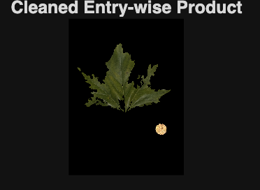
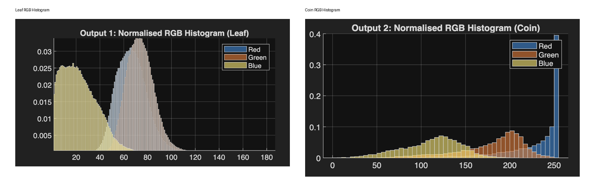
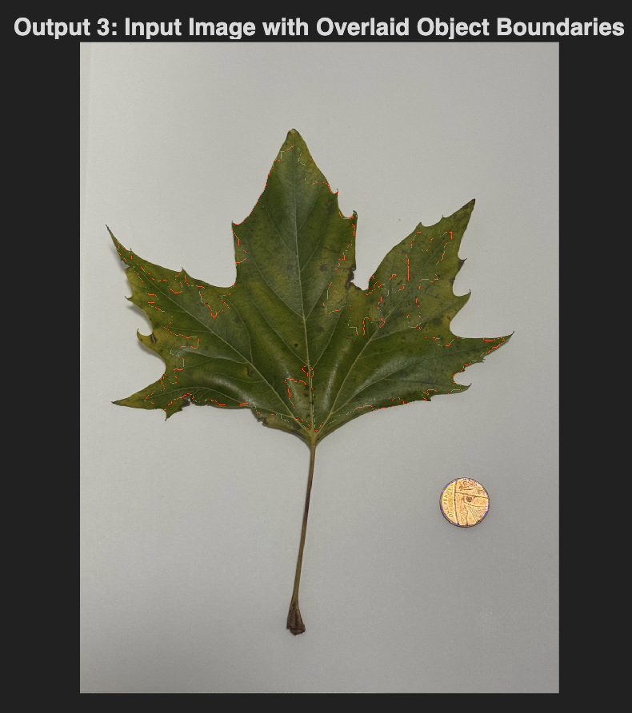
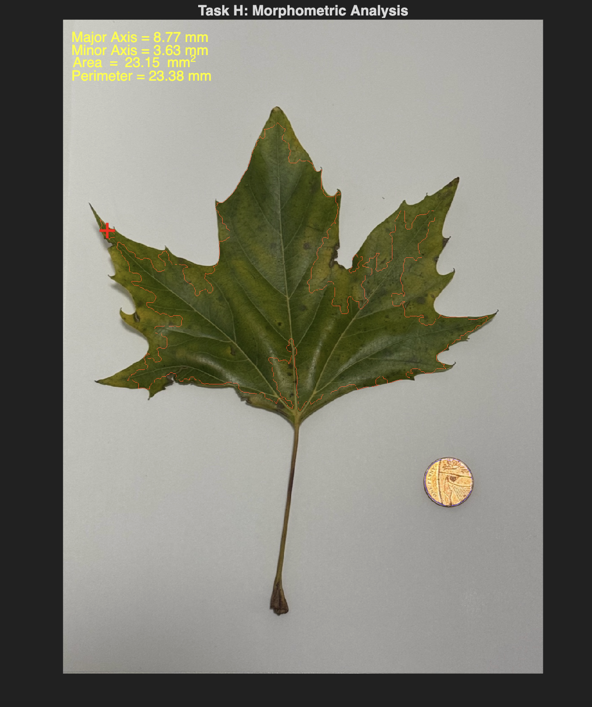
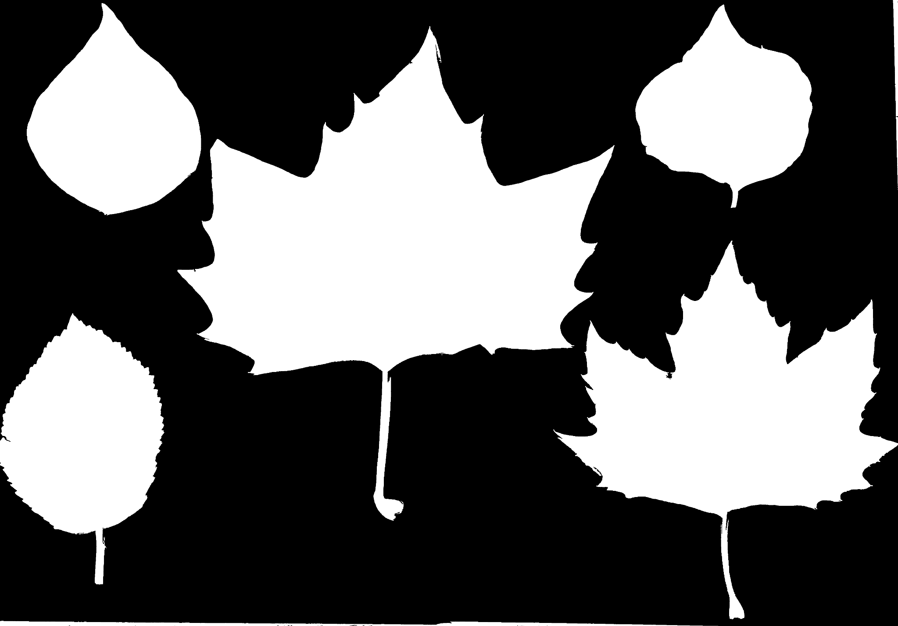

# MATLAB Image Processing & Leaf Morphometric Analysis Project

## Project Overview

This project was completed as part of the MOD002643 Image Processing module at Anglia Ruskin University. The aim of the project was to develop a MATLAB-based image processing workflow for analysing leaf images using segmentation, filtering, object detection, colour analysis and morphometric measurement techniques.

The project involved detecting a leaf and a coin from an input image, cleaning the binary masks, extracting colour information, annotating object boundaries, calculating centroid and medoid points, computing the Green Leaf Index (GLI), and performing morphometric analysis using the coin as a real-world scale reference.

The project also included a multi-leaf analysis task where the workflow was adapted to detect, count and crop multiple leaves from an image.

Final project grade: 70%

---

## Aim

The aim of this project was to apply MATLAB image processing techniques to analyse leaf morphology and visual characteristics from digital images.

The project focused on:

- Segmenting a leaf and coin from an image
- Cleaning binary masks using morphological operations
- Analysing RGB colour distributions
- Detecting and annotating object boundaries
- Calculating centroid, medoid and Green Leaf Index values
- Measuring leaf dimensions using a coin-based scale
- Extending the workflow to multiple leaves

---

## Technologies Used

- MATLAB
- Image Processing Toolbox
- HSV colour thresholding
- Binary masks
- Morphological operations
- RGB histograms
- Boundary detection
- Centroid and medoid calculation
- Green Leaf Index calculation
- Morphometric analysis
- Multi-object segmentation

---

## Key Features

- Leaf and coin segmentation using HSV multiband thresholding
- Binary mask generation for separate objects
- Noise removal and hole filling using morphological filtering
- RGB histogram analysis for segmented leaf and coin regions
- Boundary extraction and overlay on the original image
- Centroid and medoid detection for each object
- Green Leaf Index calculation for leaf analysis
- Real-world leaf measurements using coin scaling
- Multi-leaf detection, counting and cropping

---

## Project Workflow

### 1. Object Segmentation

The original image contained a flat leaf and a copper coin placed on a plain background. MATLAB was used to convert the image into HSV colour space and apply multiband thresholding to isolate the leaf and coin separately.

The result produced:

- Leaf binary mask
- Coin binary mask
- Combined segmented output using the union of both masks

### 2. Morphological Cleaning

Morphological operations were used to clean the binary masks by removing noise, filling holes and retaining the main selected objects. This improved the quality of the segmentation and produced more solid object masks.

Methods used included:

- `bwareaopen`
- `imfill`
- `bwareafilt`
- `imclose`
- Structuring elements using `strel`

### 3. RGB Histogram Analysis

RGB histograms were generated for the segmented leaf and coin objects. The cleaned masks were used to ensure that only pixels belonging to the selected object were included in the analysis.

This allowed the colour characteristics of the objects to be compared. The leaf showed stronger green channel intensity, while the coin displayed stronger red/orange characteristics.

### 4. Boundary Annotation

The cleaned binary masks were used to extract object boundaries. These boundaries were then overlaid onto the original image to clearly show the detected outline of the leaf and coin.

This confirmed that the segmentation and cleaning process produced accurate object boundaries.

### 5. Centroid, Medoid and GLI Calculation

The centroid and medoid of the segmented objects were calculated using the cleaned masks and boundary points.

The Green Leaf Index (GLI) was also calculated for the leaf using the average red, green and blue pixel values from the segmented leaf region.

The GLI helped provide a simple indicator of leaf greenness based on image colour information.

### 6. Morphometric Analysis

The coin was used as a reference object for real-world scaling. Since the coin diameter was known, the pixel-to-millimetre scale was calculated and applied to the leaf.

The following measurements were extracted:

- Major axis length
- Minor axis length
- Leaf area
- Leaf perimeter

These measurements were then annotated on the output image.

### 7. Multi-Leaf Analysis

The workflow was extended to process an image containing multiple leaves. The system used adaptive thresholding, binary mask cleaning and connected component analysis to detect and count multiple leaves.

The output included:

- Multi-leaf binary mask
- Number of detected leaves
- Cropped images of individual leaves

---

## Screenshots

### Cleaned Segmentation Output

### RGB Histogram Analysis

### Boundary Detection and Overlay

### Morphometric Analysis

### Multi-Leaf Binary Mask

---

## Skills Demonstrated

- MATLAB programming
- Image processing
- Computer vision fundamentals
- Object segmentation
- Morphological filtering
- Feature extraction
- Data visualisation
- Statistical image analysis
- Technical problem-solving
- Scientific measurement using image-based scaling

---

## What I Learned

This project helped me develop practical experience in applying image processing methods to real-world image analysis tasks. I gained a stronger understanding of how segmentation, filtering and morphology can be used to detect and measure objects from digital images.

I also learned how image processing can be used for biological and scientific analysis, particularly through leaf morphometric measurement, Green Leaf Index calculation and multi-object detection.

---

## Project Outcome

The project successfully completed a multi-stage MATLAB image processing workflow including segmentation, mask cleaning, histogram analysis, boundary detection, centroid and medoid calculation, GLI measurement, morphometric analysis and multi-leaf detection.

Final grade achieved: 70%

---

## Project Status

Completed as part of BEng (Hons) Computer Science studies at Anglia Ruskin University.
